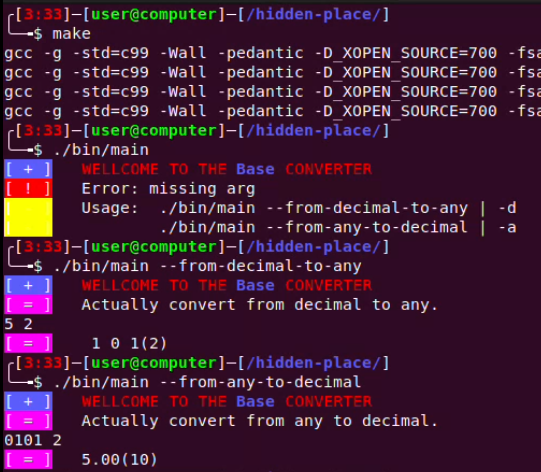

# Computer Organization and Architecture - Assignment 01 _[Numerical base converter]_

## Requirements

|   Techno   | Version |
|:----------:|---------|
|    C       |   C99   |
|    gcc     |   11    |
|    make    |   4.2   | 

*Possible to use without `make`*

> System libs requirements
> - `stdlib.h`
> - `stdio.h`

>> Custom embedded libs
>> - `input.h` : User input management system.
>> - `str.h` : Lightweight simple string management system.
>> - `convert.h` : Module containing the numeric conversion functions between bases.

### Structure
```bash
.
├── bin
├── demo.mp4
├── doc
├── Doxyfile
├── Makefile
├── README.md
└── src
    ├── convert.c
    ├── convert.h
    ├── input.c
    ├── input.h
    ├── main.c
    ├── str.c
    └── str.h

3 directories, 11 files
```

## Getting Started

### Compile **With `make`**
> Go to the root folder which contains the `Makefile` and the `src` folder.

Just type the make command :
```bash
make
```
*Generates the executable in the `bin` folder.*

### Compile **Without `make`**
Just type the make command :
```bash
gcc -g -std=c99 src/str.c src/input.c src/convert.c src/main.c -o bin/main
```
*Generates the executable in the `bin` folder.*

### Run
> Once the compilation has been validated, all that remains is to execute the compiled file which is in the `bin` folder.
Just type the make command :
```bash
./bin/main
```

### How to use
The program takes the operating mode as a parameter. There are two modes: Conversion from decimal base to a given base. Conversion from a given base to the decimal base.

Two modes of use redirect the output of a command via the pipe, or directly launch the program and enter the values.

```bash
# Using the pipe :
echo "5 2" | ./bin/main --from-decimal-to-any
echo "0101 2" | ./bin/main --from-any-to-decimal

# Input during execution :
./bin/main --from-decimal-to-any
5 2

./bin/main --from-any-to-decimal
0101 2
```
*Example of input via redirect and vie direct input*

## Example 


You can watch an example video of how to use the program: [demo.mp4](demo.mp4)

## Troubleshooting